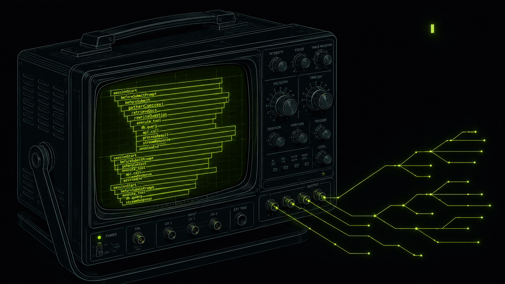

# cursorscope



Cursor IDE generates a lot of signal — sessions, prompts, tool calls, model switches, compactions, subagents. None of that goes anywhere by default. cursorscope fixes that.

It's a small Node.js service that intercepts Cursor's hook events and exports them as proper OpenTelemetry traces, metrics, and logs to any OTLP-compatible backend. You get full observability into how your team uses Cursor: which models they reach for, how long agent loops run, where tools fail, how token budgets are spent.

## How it works

Cursor fires lifecycle hooks (`sessionStart`, `beforeSubmitPrompt`, `preToolUse`, etc.) as JSON on stdin to a shell script. `.cursor/hooks/forward.sh` hands that JSON to a Node forwarder script, which posts it to a local HTTP ingestor. The ingestor maps hook events onto OTel spans — correlating them by conversation ID and generation ID so tool calls nest correctly inside their parent prompt spans — and exports everything via OTLP.

The result is a proper distributed trace for every agent interaction: session span at the root, prompt spans as children, tool call spans underneath those, subagent spans branching off in parallel when Cursor fans out work.

## Quick setup (recommended)

One command installs to `~/.cursorscope`, writes `.env`, registers global Cursor hooks, and starts the ingestor:

```bash
npx @last9/cursorscope
```

Interactive setup opens [Last9 → OpenTelemetry integration](https://app.last9.io/integrations?category=all&integration=OpenTelemetry) (or prints the link) so you can copy the OTLP endpoint and Basic auth token. It then asks for your base URL (default `https://otlp-aps1.last9.io`) and auth value.

**Note:** The OTLP auth token is only visible to **Last9 organization admins**. If you are not an admin, ask your Last9 admin to copy it from that integration page and share it with you.

Non-interactive:

```bash
npx @last9/cursorscope setup --last9 --yes \
  --otlp-base https://otlp-aps1.last9.io \
  --auth-token "$LAST9_OTLP_TOKEN"
```

Restart Cursor and send one Agent message.

Other commands:

```bash
npx @last9/cursorscope start
npx @last9/cursorscope status
npx @last9/cursorscope hooks install
```

## Manual setup

Install dependencies:

```bash
npm install
```

Copy the env file and fill in your OTLP destination:

```bash
cp .env.example .env
```

The minimum you need to export to a remote backend:

```
OTEL_EXPORTER_OTLP_ENDPOINT=https://your-otlp-endpoint
OTEL_EXPORTER_OTLP_HEADERS=Authorization=Basic <base64-credentials>
OTEL_EXPORTER_OTLP_METRICS_TEMPORALITY_PREFERENCE=cumulative
```

### Auto-start (recommended)

Install global hooks once — **merges** into `~/.cursor/hooks.json` without removing your existing hooks (`rtk`, custom scripts, etc.). A timestamped backup is created first.

```bash
npm run install:global-hooks
```

Restart Cursor and open a new chat. The ingestor starts in the background automatically (`~/.cursor/cursorscope.log`). No manual `npm start`.

```bash
npm run stop                    # stop background ingestor
npm run uninstall:global-hooks  # remove only cursorscope hook entries
```

Set `CURSORSCOPE_AUTO_START=false` in `.env` if you prefer manual `npm start`.

Register all hook types (optional): `CURSORSCOPE_HOOK_EVENTS=all npm run install:global-hooks`

### Per-project hooks

Point Cursor at `.cursor/hooks.json` in this repo. Hooks call `.cursor/hooks/forward.sh`, which auto-starts the ingestor and forwards events.

### Manual start

```bash
npm start
```

For a central install, set `CURSORSCOPE_HOME` and `CURSOR_HOOK_ENDPOINT` to your running service URL.

## With an OTel Collector

To fan out to multiple backends or pre-process telemetry, run the included Collector:

```bash
docker compose up -d
```

This starts `otel/opentelemetry-collector-contrib` listening on `localhost:4317` (gRPC) and `localhost:4318` (HTTP). The local config (`otel/collector.local.yaml`) sends everything to the debug exporter so you can see what's being emitted. Swap in `otel/collector.last9.yaml` or write your own to route to a real backend.

## Cursor Admin API polling

If you have a Cursor Business account, cursorscope can poll the Admin API for team-level daily usage metrics (requests, tokens, model breakdowns) and export them as OTel gauges.

```
ENABLE_CURSOR_API_POLLING=true
CURSOR_ADMIN_API_KEY=<your-key>
CURSOR_TEAM_ID=<your-team-id>
CURSOR_API_POLL_INTERVAL_MS=300000
```

## Privacy

User prompts are redacted by default — only prompt length is recorded. Set `CURSOR_LOG_USER_PROMPTS=true` to include prompt text in spans and logs. API keys and bearer tokens are scrubbed automatically regardless of that setting. Set `CURSOR_MASK_USER_EMAIL=true` to mask the `cursor.user.email` span attribute before it reaches your OTLP backend.

## What you get

**Traces** — one root span per session, one span per prompt/generation, tool call spans as children with duration and success/failure, subagent spans that branch from parent conversations.

**Metrics** — `cursor_hook_events_total`, `cursor_session_total`, `cursor_prompt_total`, `cursor_tool_executions_total`, `gen_ai.client.operation.duration`, `gen_ai.client.token.usage`, `cursor_api_metric_value` (from Admin API polling).

**Logs** — one structured log record per hook event with conversation ID, model, and hook-specific fields.

Metric attribute names follow the [OTel GenAI semantic conventions](https://opentelemetry.io/docs/specs/semconv/gen-ai/) where applicable.

## Debug endpoints

```
GET  /healthz               — liveness check
GET  /debug/otel-config     — show resolved OTLP endpoints and config
POST /debug/emit-and-flush  — emit a test trace/metric/log and force flush
GET  /debug/otlp-probe      — probe connectivity to all configured OTLP endpoints
```

## Requirements

Node.js 20 or later. No build step.
