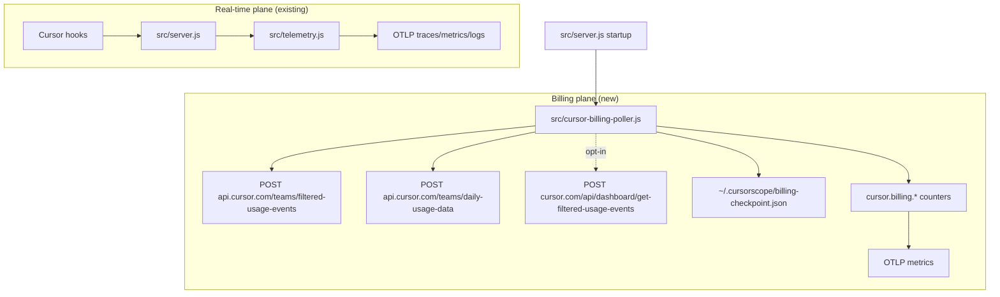

# feat: Cursor billing truth via Admin API and optional dashboard fallback

## Summary

cursorscope exports rich real-time Cursor behavior over OTLP hooks, but it does not export **authoritative billing data** (billed tokens, cache breakdown, true USD spend, included vs overage, headless/cloud agents). The existing Admin API poller is misaligned with Cursor’s documented contract and likely non-functional. This plan fixes daily-usage polling, adds `filtered-usage-events` as the billing source of truth, and optionally supports a session-cookie dashboard fallback for individual users — without changing cursorscope’s privacy posture or becoming a leaderboard CLI.

## Problem Frame

Compared to tools like [whoburnedmore](https://github.com/amiinwani/whoburnedmore.com), cursorscope is stronger on **live observability** (traces, MCP/skill/subagent attribution, GenAI semconv) but weaker on **billing truth**:

| Gap | Impact |
|-----|--------|
| Hook path records estimated context tokens, not Cursor-billed LLM tokens | Dashboards cannot answer “how much did we spend?” from hooks alone |
| `src/cursor-api-poller.js` uses GET + Bearer + wrong path | Enterprise polling likely fails silently or never runs |
| No `filtered-usage-events` ingestion | Missing `chargedCents`, cache tokens, `isHeadless`, `kind` |
| No historical backfill before install | Only events after ingestor start are visible via hooks |
| No individual-user billing without Enterprise API | Pro/team users cannot reconcile spend locally |

cursorscope should remain an OTLP exporter, not a whoburnedmore clone. The fix is a **second telemetry plane**: hooks for behavior, billing API for dollars and billed tokens.

---

## Requirements

- R1. When `ENABLE_CURSOR_API_POLLING=true` and `CURSOR_ADMIN_API_KEY` is set, the poller successfully calls Cursor’s documented Admin API using **POST + Basic auth**.
- R2. Daily activity metrics from `POST /teams/daily-usage-data` are exported with per-user, per-day labels (`cursor.user.email`, `cursor.billing_day`) for fields such as `agentRequests`, `chatRequests`, `composerRequests`, `usageBasedReqs`, and line/tab stats.
- R3. Billing metrics from `POST /teams/filtered-usage-events` use **`chargedCents`** for spend (not `tokenUsage.totalCents` alone) and export token breakdowns when `tokenUsage` is present.
- R4. Billing metrics carry dimensions: `gen_ai.request.model`, `cursor.billing.kind`, `cursor.is_headless`, `cursor.chargeable` (spend gauges only), `cursor.user.email` (when present), `cursor.billing.source`, `cursor.billing_day`.
- R5. Pagination is complete: pollers loop until `hasNextPage === false` and handle mid-pagination failures without emitting partial totals that shrink on the next run.
- R6. Default poll interval respects Cursor guidance (≤1 poll/hour); configurable via env.
- R7. Billing metrics are clearly separated from hook-estimated `cursor_attributed_context_tokens_total` (distinct metric names and documentation).
- R8. Optional opt-in dashboard fallback (`ENABLE_CURSOR_DASHBOARD_POLLING`) reads local session token only; never uploads the token; emits the same billing metric shape as R3–R4.
- R9. Unit tests cover auth headers, HTTP method/body, pagination, event mapping, and metric emission — no live API calls in CI.
- R10. README and `.env.example` accurately describe what is authoritative vs estimated.

---

## Key Technical Decisions

| ID | Decision | Rationale |
|----|----------|-----------|
| KTD-1 | **Three spend gauges** (`charged_usd`, `model_cost_usd`, `cursor_token_fee_usd`) from API fields; token fields feed token gauges | Matches Cursor reconciliation; whoburnedmore undercounts by using `totalCents` only |
| KTD-2 | **Admin API is primary; dashboard API is opt-in fallback** | Enterprise teams get stable, keyed access; individuals without Admin API still get billing truth locally |
| KTD-3 | **Calendar-day gauges** for billing and activity (`cursor.billing.*`, `cursor.activity.*`), not per-event cumulative counters | Polled API data is batch/idempotent; gauges SET absolute day totals and survive re-poll without dedupe; hooks stay counters |
| KTD-4 | **Keep hook attribution metrics unchanged** | `cursor_attributed_context_tokens_total` answers “what flowed through tools”; billing answers “what Cursor charged” — conflating them misleads |
| KTD-5 | **Default `CURSOR_API_POLL_INTERVAL_MS=3600000`** (1 hour) | Cursor aggregates hourly; current 5-minute default risks 429s and adds no freshness |
| KTD-6 | **Sliding refresh poll window** — incremental `(lastEnd, now]` plus re-aggregate last `CURSOR_BILLING_REFRESH_DAYS` (default 3); first run uses `CURSOR_BILLING_LOOKBACK_DAYS` (30) | Balances 429 risk vs late Cursor amendments to prior days |
| KTD-7 | **Deprecate `CURSOR_TEAM_ID` for API path** | Admin API scopes by key; team ID in URL is undocumented and incorrect — keep optional label only if needed for multi-team operators |

| KTD-8 | **`CURSOR_BILLING_SOURCE=auto|admin|dashboard`** — never poll both APIs in one run | Prevents duplicate day gauges when Enterprise key and dashboard flag are both set; `auto` prefers admin |

| KTD-9 | **Remove `cursor_api_metric_value` / `observeCursorApiMetric`** | Pre-1.0, poller was broken; day gauges replace unlabeled 5-minute TTL snapshots |

| KTD-10 | **`is_headless` label only** for agent context on billing gauges v1 | Every event has it; `hostingType` multi-pass deferred |

| KTD-11 | **`node:sqlite` with `sqlite3` CLI fallback** for dashboard `state.vscdb` token read | No new npm dependency; Node 20 LTS works when `sqlite3` is on PATH; warn once if both paths fail |

| KTD-12 | **Shared checkpoint module in U3** — `$CURSORSCOPE_HOME/.cursor-api-checkpoint.json`; advance only after full poll tick succeeds (U6 gate) | One `lastSuccessfulPollEndMs` for billing + activity sliding refresh; partial failure leaves checkpoint unchanged |

| KTD-13 | **`src/cursor-billing-day.js`** — `toBillingDay(epochMs, tz)` + `normalizeActivityDay(apiDay, tz)` | Single tested implementation for `cursor.billing_day` bucketing across billing events and activity rows |

| KTD-14 | **OTel gauge labels use `cursor.*` namespace** — `cursor.billing_day`, `cursor.user.email`, `cursor.billing.kind`, `cursor.is_headless`, `cursor.chargeable`, `cursor.billing.source`; model = `gen_ai.request.model`; apply `maskEmail()` when `CURSOR_MASK_USER_EMAIL=true` | Stable keys for U2 allowlist; privacy parity with hooks |

| KTD-15 | **Platform default `state.vscdb` paths** + `CURSOR_STATE_VSCDB_PATH` override | Dashboard auth works on macOS/Linux/Windows without manual config |

---

## High-Level Technical Design

**Poll sequence (each interval):**

1. Load checkpoint → compute `[startDate, endDate]` (ms, inclusive, non-overlapping).
2. If Admin API enabled: paginate `filtered-usage-events` → emit billing counters → advance checkpoint only after full success.
3. If daily metrics enabled (same flag or sub-flag): paginate `daily-usage-data` with `page`+`pageSize` → emit activity gauges/counters.
4. If dashboard fallback enabled and Admin API unavailable: read `state.vscdb` token → cookie → dashboard endpoint → same mapper as step 2.

**Metric naming (billing plane — calendar-day gauges, refreshed each poll):**

Shared label keys (OTel attributes): `cursor.billing_day`, `gen_ai.request.model`, `cursor.billing.kind`, `cursor.is_headless`, `cursor.user.email`, `cursor.billing.source`; spend gauges also `cursor.chargeable` (`"true"` / `"false"`). `cursor.user.email` passes through `maskEmail()` when `CURSOR_MASK_USER_EMAIL=true`.

| Metric | Type | Labels | Value |
|--------|------|--------|-------|
| `cursor.billing.charged_usd` | Gauge | all shared + `cursor.chargeable` | Sum `chargedCents / 100` for bucket |
| `cursor.billing.model_cost_usd` | Gauge | all shared + `cursor.chargeable` | Sum `tokenUsage.totalCents / 100` |
| `cursor.billing.cursor_token_fee_usd` | Gauge | all shared + `cursor.chargeable` | Sum `cursorTokenFee / 100` |
| `cursor.billing.input_tokens` | Gauge | shared (no `cursor.chargeable`) | Sum input tokens for bucket |
| `cursor.billing.output_tokens` | Gauge | shared (no `cursor.chargeable`) | Sum output tokens |
| `cursor.billing.cache_read_tokens` | Gauge | shared (no `cursor.chargeable`) | Sum cache read |
| `cursor.billing.cache_write_tokens` | Gauge | shared (no `cursor.chargeable`) | Sum cache write |
| `cursor.billing.events_total` | Gauge | shared (no `cursor.chargeable`) | Event count for bucket |

**Activity plane gauges** (`cursor.activity.*`): `cursor.billing_day`, `cursor.user.email`, `cursor.billing.source`; values from `daily-usage-data` fields (e.g. `agent_requests`, `chat_requests`).

---

## Scope Boundaries

**In scope**

- Fix and extend Admin API polling
- Billing metric emission via OTLP
- Dashboard session-cookie fallback (opt-in)
- Tests, README, env templates

**Deferred for later**

- `cursorscope report` local HTML/JSON summary (whoburnedmore `--local` parity)
- Parsing `~/.cursor/projects/*/agent-transcripts` for session titles when hooks miss
- Hook ↔ billing reconciliation join by conversation ID (needs Cursor to expose IDs on usage events)
- Analytics API / AI Code Tracking API
- Multi-agent aggregation (Claude, Codex) — outside cursorscope’s identity

**Outside this product’s identity**

- Public leaderboard upload
- Replacing Last9/Grafana dashboards with a built-in UI

### Deferred to Follow-Up Work

- CLI `cursorscope billing status` debug command showing last poll, checkpoint, event counts
- Dashboard fallback: activity metrics (`daily-usage-data` equivalent) if Cursor exposes them on dashboard API

---

## Implementation Units

Build order: **U1 ∥ U2** → **U3** → **U4** → **U5** → **U6**.

### U1. Shared Cursor API client

**Goal:** One module for Admin API auth, POST helpers, pagination, and 429 backoff.

**Requirements:** R1, R5, R6

**Dependencies:** None

**Files:**

- Create `src/cursor-api-client.js`
- Create `test/cursor-api-client.test.js`

**Approach:**

- `adminApiAuthHeader(apiKey)` → `Authorization: Basic base64(apiKey + ':')`
- `postAdminJson(path, body, { apiKey, baseUrl })` with timeout and structured errors
- `paginateAdmin(path, buildBody, parsePage)` generic loop using `hasNextPage`
- Exponential backoff on 429 per Cursor docs (1s → 16s cap)

**Patterns to follow:** Plain ESM like `src/otlp-probe.js`; `node:assert/strict` tests with mocked `fetch`.

**Test scenarios:**

- Happy path: Basic auth header matches `Buffer.from('key:').toString('base64')`
- Pagination: two pages merged; stops when `hasNextPage` is false
- Error path: 401 throws descriptive error; 429 retries then fails
- Mid-pagination failure: throws without partial callback invocation

**Verification:** `npm test` passes; no network in CI.

---

### U2. Day-gauge telemetry primitives

**Goal:** Replace `observeCursorApiMetric` with `setBillingDayGauge` / `setActivityDayGauge` ObservableGauge store.

**Requirements:** R3, R4, R7, R9

**Dependencies:** None (land in parallel with U1; blocks U3/U4)

**Files:**

- Modify `src/telemetry.js` — remove `observeCursorApiMetric`; add day gauge registry
- Create `test/day-gauges.test.js`
- Modify `test/telemetry.test.js` — remove legacy gauge test

**Approach:**

- ObservableGauge **per metric name** (allowlist); `setBillingDayGauge(name, value, labels)` validates label keys against KTD-14 table
- `setBillingDayGauge(name, value, labels)` / `setActivityDayGauge(name, value, labels)`
- Label sanitizer: coerce `cursor.user.email` through `maskEmail()` when `CURSOR_MASK_USER_EMAIL=true`
- Gauges persist until overwritten (no 5-minute TTL); today's bucket refreshes each poll
- Export `_testHooks.getDayGaugeStore()` for poller tests

**Test scenarios:**

- Set gauge twice same labels → second value wins (idempotent re-poll)
- Billing and activity gauges use distinct name prefixes
- Removed `observeCursorApiMetric` — no references remain

**Verification:** Unit tests; grep confirms legacy symbol gone.

---

### U3. Billing metrics poller (`filtered-usage-events`)

**Goal:** Paginate usage events, aggregate to **billing day** buckets, emit `cursor.billing.*` **day gauges**.

**Requirements:** R3, R4, R5, R7, R9

**Dependencies:** U1, U2

**Files:**

- Create `src/cursor-billing-poller.js`
- Create `src/cursor-billing-aggregator.js` (events → `Map<bucketKey, totals>`)
- Create `src/cursor-billing-mapper.js` (normalize admin vs dashboard event shapes)
- Create `src/cursor-api-checkpoint.js` (read/write JSON + `resolvePollWindow`)
- Create `src/cursor-billing-day.js` (`toBillingDay`, `normalizeActivityDay`)
- Create `test/cursor-billing-aggregator.test.js`
- Create `test/cursor-billing-poller.test.js`
- Create `test/cursor-api-checkpoint.test.js`
- Create `test/cursor-billing-day.test.js`
- Modify `src/cursor-api-poller.js` — poll entry stub (full orchestration in U6)

**Approach:**

- Paginate full window before emitting any gauge (partial page → no checkpoint advance)
- Poll window from `resolvePollWindow(checkpoint, now, { lookbackDays, refreshDays })`: incremental `(lastEnd, now]` plus re-fetch last `CURSOR_BILLING_REFRESH_DAYS` complete days (default 3); first run uses `CURSOR_BILLING_LOOKBACK_DAYS`
- `toBillingDay(event.timestamp, CURSOR_BILLING_TIMEZONE)` in aggregator via `cursor-billing-day.js`
- Aggregator folds events by `(cursor.billing_day, cursor.user.email, gen_ai.request.model, cursor.billing.kind, cursor.is_headless, cursor.chargeable, cursor.billing.source)`
- Three spend totals + token totals + `events_total` per bucket → `setBillingDayGauge` from U2
- `chargeable` → OTel `cursor.chargeable` (`"true"` / `"false"` from `isChargeable`) on spend gauges only
- Checkpoint file: `$CURSORSCOPE_HOME/.cursor-api-checkpoint.json` → `{ "version": 1, "lastSuccessfulPollEndMs": <number> }`; U3 reads/writes helpers only — **U6 advances after billing (+ activity when enabled) complete successfully**

**Test scenarios:**

- Covers AE2: `isHeadless: true` → bucket with `cursor.is_headless=true`
- Missing `userEmail` → `cursor.user.email=unknown`
- Pagination abort on page 2 → checkpoint unchanged, no gauge updates
- Two events same bucket same day → single gauge value = sum

**Verification:** Aggregator unit tests + mocked poller integration.

---

### U4. Activity metrics poller (`daily-usage-data`)

**Goal:** Emit **behavior plane** `cursor.activity.*` **day gauges** from Admin API.

**Requirements:** R1, R2, R5, R6, R10

**Dependencies:** U1, U2

**Files:**

- Create `src/cursor-activity-poller.js`
- Create `test/cursor-activity-poller.test.js`
- Modify `.env.example`, `src/cli/env-templates.js` (field names only; full README in U6)

**Approach:**

- Admin source only (`billing_source` `admin` or `auto` with key); skip when `dashboard`
- POST `/teams/daily-usage-data` with `startDate`, `endDate`, `page`, `pageSize`
- Map API `day` field via `normalizeActivityDay(day, CURSOR_BILLING_TIMEZONE)` → OTel `cursor.billing_day`
- Rows → `setActivityDayGauge(metric, value, labels)` from U2

**Test scenarios:**

- POST body and Basic auth correct
- `agentRequests: 3` → `cursor.activity.agent_requests` gauge for that day+user
- Skipped when `CURSOR_BILLING_SOURCE=dashboard`

**Verification:** Mocked fetch + U2 test hooks.

---

### U5. Dashboard API fallback (v1: billing only)

**Goal:** Opt-in **billing metrics** for non-Enterprise users via local session token.

**Requirements:** R8, R9

**Dependencies:** U3 (shared mapper + aggregator)

**Files:**

- Create `src/cursor-dashboard-auth.js`
- Modify `src/cursor-billing-poller.js` — dashboard branch
- Tests in `test/cursor-billing-poller.test.js` (dashboard fixtures)

**Approach:**

- Active when `CURSOR_BILLING_SOURCE=dashboard` or (`auto` without admin key and `ENABLE_CURSOR_DASHBOARD_POLLING=true`)
- Read `cursorAuth/accessToken` from `state.vscdb` at `resolveStateVscdbPath()` (platform defaults per KTD-15, override `CURSOR_STATE_VSCDB_PATH`): try `node:sqlite` (`DatabaseSync`, read-only), else `spawnSync('sqlite3', …)` like whoburnedmore; log once at warn if neither works
- Cookie → dashboard `get-filtered-usage-events`
- Reuse U3 mapper/aggregator; `source=dashboard_api`

**Test scenarios:**

- Covers AE3: dashboard path emits billing gauges, no admin fetch
- Cookie builder unit tests; token never logged

**Verification:** Unit tests only; manual smoke on signed-in Cursor.

---

### U6. Orchestration, env, and docs

**Goal:** Wire full poll cycle at startup; finalize env + README.

**Requirements:** R6, R7, R8, R10

**Dependencies:** U3, U4, U5

**Files:**

- Modify `src/server.js`
- Modify `src/cursor-api-poller.js` → `maybeStartCursorApiPolling()` runs U3+U4+U5 per source
- Modify `.env.example`, `src/cli/env-templates.js`, `README.md`, `CHANGELOG.md`

**Approach:**

- Resolve `CURSOR_BILLING_SOURCE` once per poll tick
- Env: `CURSOR_BILLING_LOOKBACK_DAYS=30`, `CURSOR_BILLING_REFRESH_DAYS=3`, `CURSOR_BILLING_TIMEZONE=UTC`, `CURSOR_BILLING_SOURCE=auto`
- Orchestration gate: run billing poll (U3/U5 path) → emit billing gauges on success; if admin, run activity poll (U4) → emit activity gauges on success; call `advanceCheckpoint(now)` **only when all enabled polls in the tick succeed** — partial failure leaves checkpoint unchanged (billing gauges may already be refreshed; idempotent re-poll next tick)
- README: behavior hooks / activity gauges / billing gauges / ADR link
- CHANGELOG: breaking removal of `cursor_api_metric_value`

**Test scenarios:**

- `auto` + key → billing + activity admin polls
- `auto` without key + dashboard enabled → billing dashboard only
- Polling disabled → no-op

**Verification:** `npm run lint && npm test`; README review.

---

## Risks and Dependencies

| Risk | Mitigation |
|------|------------|
| Enterprise-only Admin API | Document dashboard fallback; hooks remain for all users |
| 429 during large backfill | 1h default interval; backoff; bounded lookback; resume via checkpoint |
| Removed users missing `userEmail` | Label `unknown`; optional future join with `/teams/members` |
| Dashboard API changes (unofficial) | Isolated module; `source=dashboard_api` label; Admin API preferred |
| Counter cardinality explosion (model × user × kind × headless) | Document cardinality guidance; optional `CURSOR_BILLING_LABELS=min` mode in follow-up |
| Stale gauge values for past days | Each poll refreshes all days in the lookback window; gauges for days outside window are left unchanged (document) |

---

## Acceptance Examples

- **AE1. Enterprise billing export**
  - **Covers:** R1, R3, R4
  - **Given:** Valid Admin API key and polling enabled
  - **When:** Poller runs after a day with Agent usage
  - **Then:** OTLP metrics include `cursor.billing.charged_usd` with `gen_ai.request.model` label matching dashboard spend order-of-magnitude

- **AE2. Headless agent visibility**
  - **Covers:** R4
  - **Given:** Usage events with `isHeadless: true` exist in window
  - **When:** Billing poller runs
  - **Then:** Metrics exist with `cursor.is_headless=true` separate from IDE-attached usage

- **AE3. Individual user fallback**
  - **Covers:** R8
  - **Given:** No Admin API key; dashboard polling enabled; Cursor signed in locally
  - **When:** Poller runs
  - **Then:** Billing metrics emitted with `cursor.billing.source=dashboard_api`; no token leaves machine except to `cursor.com`

---

## Sources and Research

- Prior gap analysis: cursorscope vs [whoburnedmore](https://github.com/amiinwani/whoburnedmore.com) (`src/cursor.ts` billing scrape pattern)
- [Cursor Admin API](https://cursor.com/docs/account/teams/admin-api) — `daily-usage-data`, `filtered-usage-events`, `chargedCents`
- [Cursor APIs Overview](https://cursor.com/docs/api) — auth, rate limits, polling cadence
- Domain model: `CONTEXT.md`, `docs/adr/0001-billing-day-gauges.md`
- Community dashboard API shape: [dmwyatt gist](https://gist.github.com/dmwyatt/1e9359b1862e7cbfe1e754fe4c8db764)
